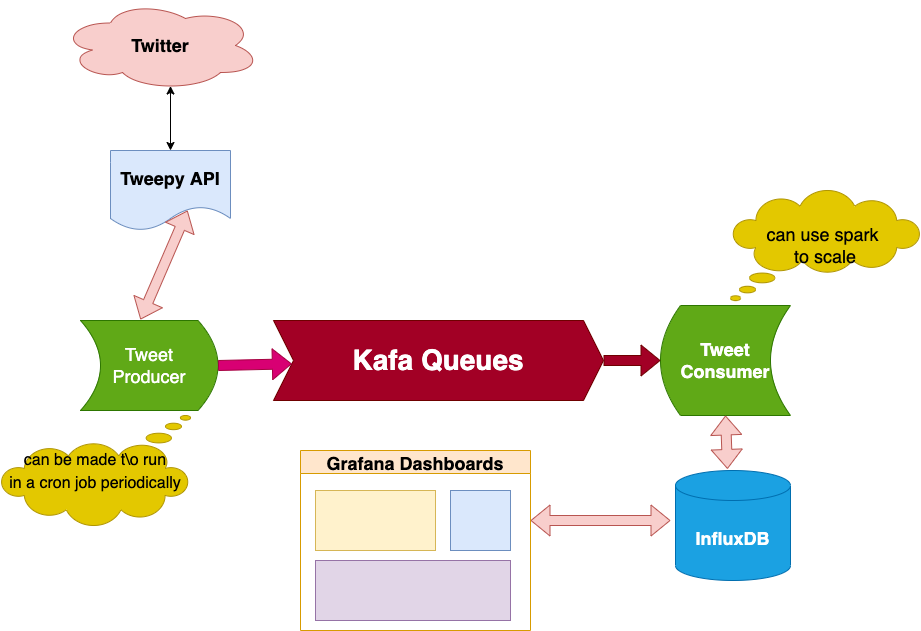

Work in progress

# Twitter sentiment analysis

**Business Understanding**:

Greed and fear are the two driving forces of the stock market. People's sentiments of the market play an important role in driving the certain stock prices up or down. In the past, there was a correlation between Tweets and social media messages driving the stock prices.

# Problem Statement
Stock prediction/ sentiment analysis:
These days the stock market is very much driven by news and social sentiments. Every day some news content, especially social news impacts the stock price and helps move the market up or down.  The goal of this project is to analyze the social and news content and do an analysis of the stock price movement. We will additionally identify stock grouping to identify stocks of similar companies that can get affected by the news. We will generate a sentiment score for the stock news.

Sentiment analysis (also known as opinion mining or emotion AI) refers to the use of natural language processing, text analysis, computational linguistics, and biometrics to systematically identify, extract, quantify, and study affective states and subjective information.
 
In simple English:
**We computers to extract meanings behind texts, images and other data.**

Stock sentiment analysis can be used to determine investors' opinions of a specific stock or asset. Sentiment may at times hint at future price action. This is also an example of how trading psychology can affect a market, assisting as a forecasting tool to determine possible future price changes in a particular asset.

Market sentiment refers to the overall consensus about a stock or the stock market as a whole.
Market sentiment is bullish when prices are rising.
Market sentiment is bearish when prices are falling.
Technical indicators can help investors measure market sentiment.

Some indicators of sentiment:
Social network feeds - Reddit, Twitter, Nasdaq
CBOE Volatility Index (VIX)
New York Stock Exchange (NYSE) High/Low Indicator
NYSE 200-day Moving Average
Odd-Lot Trading Statistics

We will use data from yahoo finance, marketwatch.com, twitter.com, and some additional resources.

# Approach to Solution

### **Hypothesis**:

Tweets today with a positive or negative sentiment containing one or several cashtags can affect the way a stock moves tomorrow.If positive sentiments of a particular stock today, that stock price is expected to rise tomorrow. If negative sentiments of a particular stock today, the stock price is expected to fall tomorrow. The more followers an account has, the more influential the tweets from that account and more impacts the sentiment on the stock price. For example, (@elonmusk tweets influence on $TSLA, $TWTR stock price.  The analysis will be observing the past few days' sentiment of high profile tech stocks ($TSLA, $TWTR, $GOOG, $AAPL, $MSFT), and predicting whether the stock will be up/down. 

## **Goal**

Input:  Download tweets regarding a certain dtock from Twitter using Tweepu API.
Output: Identify the sentiment of the tweet based on the moodel we built.

### **Data Collection**:

Downlooaded the last 30+ days of tweets of these cashtags: $TSLA, $TWTR, $GOOG, $AAPL, $MSFT using Tweepy APIs. Downloaded the stock market data from one of these sites:  Yahoo! Finance, Nasdaq, Dow Jones for the last 30+ days.

### **Data Preparation**:

We downloaded data from various kagles and finally used the file https://drive.google.com/file/d/1qfWiDDOjHKelrLcbhYu00t2zkbHppW1h/view?usp=sharing
which has about 1.6M tweets from years ago to train the models. 
We built 3 models
- logistic regression
- Naive Bayes
- BERT 

## Clean the data and do the exploratory analysis

 **Preprocessing**
Steps involved in pre-processing:

Replacing emoticons with weights without disturbing it's polarity.
Replacing usernames, URLs with symbols like ||T||, ||U||.
Replacing words with more than 3 continuous repeating characters with only 3 occurrence. ​
Removing all the stop words and punctuation.
Replacing all hashtags with the name in it.
Replacing all the abbreviations with their full-forms.

 **Tokenizing**
It is just the term used to describe the process of converting the normal text strings into a list of tokens i.e. words that we actually want. Sentence tokenizer can be used to find the list of sentences, and Word tokenizer can be used to find the list of words in strings.

So after parsing the original tweets will be processed by above steps and will be written to separate file which will be used in later stage.
 
 **Stemming**
Stemming is the process of reducing inflected (or sometimes derived) words to their stem, base or root form — generally a written word form. For example, if we were to stem the following words: “Stems”, “Stemming”, “Stemmed”, “and Stemtization”, the result would be a single word “stem”.

**Feature Vectors**

With the processed dataset, we created feature vectors.​
There are various ways to extract features from the cleaned data:
1. Bag-of-words
2. TF-IDF
3. Word2vec

The basic feature that was considered was of unigrams.​
A list of all unique unigrams(tokenized words) across the training set was constructed and it formed the feature vector for all the tweets.​
 
 **Enhancing Feature Vectors​**
To improve the efficiency of the algorithm, we have added few more features to the existing one.​
In addition to the unique unigrams, few features like​ the following were also added
 
1. Count of hashtags
2. Bigrams
3. Count of emoticons
4. Count of Negative words

## Classification and Evaluation
Now that we are ready with our pre-modeling stages of the data its time to classify them on the sections in which I have prepared the data that is Bag-of-words, TF-IDF, word2vec vectors, and doc2vec vectors. I know you are excited to get your hands and mind dirty by implementing different machine learning models that you always have heard of. Let me take you all one by one through each of these algorithms. Mind you I will not deep dive in every detail but enough to understand how and why these algorithms are helpful in our Sentiment analysis. I have implemented the below algorithms.

1. Logistic Regression
2. Naive Bayes
3. BERT
4. Support Vector Machine
5. RandomForest
6. XGBoost

I built 3 models:
1. Logistic Regression
2. Naive Bayes
3. BERT

## Measuring the sentiment in tweets:
Extract the sentiment of each tweet using python pre-trained models using Logistic Regression, Naive Bayes and BERT.
Each tweet is multiplied by the number of followers of the account. More weight given to the tweets from influential accounts.

**Stock Data**:
Stock data is downloaded and calculate the ‘daily % change’ and storred in a database column.

You can use the yFinance API in python to get any stock data from yahoo finance. This is what I used for getting stock data for a certain period and store them inthe influxdb data

### **Modeling**:

**Logistic Regression** is a classification algorithm could help us predict whether the given Tweet is positive or negative. Logistic regression predictions are distinct. We can also view probability scores underlying the model’s classifications.

**Naive Baye** is a classification technique based on the Bayes’ Theorem with an assumption of independence among predictors. Bayes’ Theorem provides a way in which an equation is describing the relationship of conditional probabilities of statistical quantities. In Bayesian classification, we’re interested in finding the probability of a label given some observed features.

## Model evaluation:    
Models for sentiment analysis, and stock price classification(up/down) are chosen by based on evaluation metrics:
Accuracy
Precision
Recall
F1 Score

## Model Deployment:

**I created 2 applications.
**
**First application** shows the live sentiment of tweets when executed. It is built using Streamlit APIs and is dockerized. When you provide a stock symbol, it downloads last 10 mins of tweets and analysis using one of the models we built () and outputs the results.

**The second application** is a scaled verion of this. It uses Tweepy streaming API to get continuous stream of tweets, sned them to a Kafka queue. Then another process resds the tweets off of the kafka queue and analyses using the models. and output the results in an influxDB.

I chose influxdb as the data store so that I can qickly plot the various cahrts/plot using Grafana.
All of the processes above are dockerized:
1. Tweet producer
2. Kafka engine with a tweet topic
3. Tweet consumer
4. InfkudDB
5. Grafana dashboard with customeized panels

 The dashboards will be displayed for these stocks price trendline, along with social sentiment. Users will have capability to query the data.

# Production deployment 

# Running the final code
There are 2 applications.

1 - streamlit live sentiment analysis using logidtic regression -- please see README in part1

2 - scaled version using kafka/influxDB/grafana -- please see README in part2

Helpful docker and AWS commands:
================================
Docker Instructions:
====================

docker ps -a
docker rm <ID>
docker rmi <image ID>

docker build -t rbyakod/twitter-sentiment .
docker run -p 9000:9000 -d rbyakod/twitter-sentiment

docker login -u  rbyakod
docker push rbyakod/twitter-sentiment:latest

AWS commands:
=============
LOGIN to your AWC instance:
ssh -i "twitter-sentiment.pem" ec2-user@ec2-18-237-125-37.us-west-2.compute.amazonaws.com

port forwarding on your localhost:
ssh -i "./twitter-sentiment.pem" ec2-user@ec2-18-237-125-37.us-west-2.compute.amazonaws.com -L 2081:localhost:2041 -L 4888:localhost:4888 -L 2080:localhost:2080 -L 27017:localhost:27017 -L 28017:localhost:28017  -L 8050:localhost:8050 -L 4141:localhost:4141 -L 3880:localhost:3880 -L 9001:localhost:9001

copying files to AWS :
scp -r -i "./twitter-sentiment.pem" "Codes/DockerCompose/" ec2-user@ec2-18-237-125-37.us-west-2.compute.amazonaws.com:/home/ec2-user/docker_compose

run docker:

you can pull as well:
docker pull rbyakod/twitter-sentiment:latest

or run directly:
docker run -p 9001:9001 -d rbyakod/twitter-sentiment

LOGs:
docker logs <container ID> -f

access by using last host port combo:
http://18.237.125.37:9001
