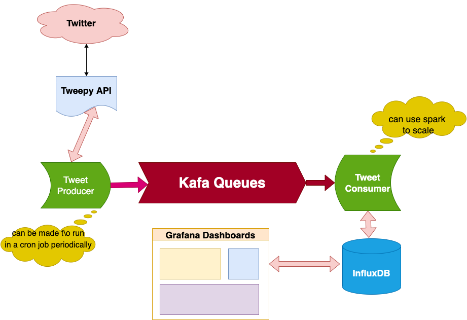

## Deployment

Local deployment is done through this [docker-compose.yaml](docker-compose.yaml) file.

Compose offers a way to control the order of statup and shutdown of containers through the `depends_on` option, but, by design, [there is no way to delay statup until a service becomes available](https://docs.docker.com/compose/startup-order/) - unless we run a script that waits for a service to become available with a `command` option.

> To handle this, design your application to attempt to re-establish a connection to the database after a failure. If the application retries the connection, it can eventually connect to the database.

### Requirements

- After obtaining your set of Twitter API key and secret, you have to set those in the [secret.ini](./produce-tweets/secret.ini) file.


### Starting the Services

Services need to be started in a specific order with the following commands:
```
# Start Kafka and InfluxDB
docker-compose up -d kafka influxdb

# Start Grafana
docker-compose up -d grafana

# Start the producer and the consumer
docker-compose up -d producer consumer

### Useful Links
- [Twitter Developers portal](https://developer.twitter.com/en/docs)
- [Sentiment Analysis with Python NLTK](https://www.digitalocean.com/community/tutorials/how-to-perform-sentiment-analysis-in-python-3-using-the-natural-language-toolkit-nltk)
- [Kafka Quickstart](https://kafka.apache.org/quickstart)
- [A Practical Introduction to Kafka Storage Internals](https://medium.com/@durgaswaroop/a-practical-introduction-to-kafka-storage-internals-d5b544f6925f)
- [Deploy a Kafka broker in a Docker container](https://www.kaaproject.org/kafka-docker)
